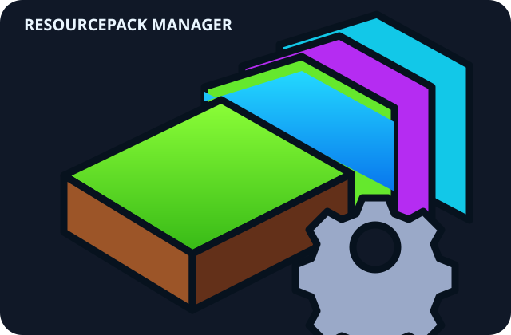

# ResourcePack Manager — Forge

<p align="center">
  
</p>

A client-side Minecraft Java mod for **Minecraft 1.21.11**, built for **Minecraft Forge**.

## Project details

- **Minecraft:** 1.21.11
- **Forge:** 61.2.0
- **Java:** 21
- **Gradle:** 9.6.0
- **Mod version:** 0.2.0
- **In-game key:** `K`

## Features

- Opens Minecraft's built-in resource-pack selection screen.
- Featured links for Faithful 32x, Ashen, and Excalibur resource packs.
- Featured links for Sodium, Lithium, FerriteCore, ImmediatelyFast, and Entity Culling.
- Opens official Modrinth project pages in the browser.

The catalog links to official project pages; it does not bundle or automatically install third-party files. Check each project's Minecraft version, Forge support, dependencies, and license before installing.

## Build

Install **JDK 21** and Gradle 9.6.0, then run:

```bash
cd resourcepack-manager/forge
gradle --no-daemon clean build verifyModJar
```

The JAR is written to `resourcepack-manager/forge/build/libs/`. GitHub Actions builds this Forge project and uploads the JAR as a workflow artifact.

## CI

The workflow runs on pushes, pull requests, and manual dispatch. It uses Java 21 and Gradle 9.6.0, builds the Forge project in its own directory, verifies required JAR entries, and uploads the artifact only after successful verification.

## References

- [Forge 1.21.11 downloads and MDK](https://files.minecraftforge.net/net/minecraftforge/forge/index_1.21.11.html)
- [ForgeGradle 7 example project](https://github.com/MinecraftForge/MDKExamples/tree/master/traditional-mdk/fg7)
- [Modrinth](https://modrinth.com/)
